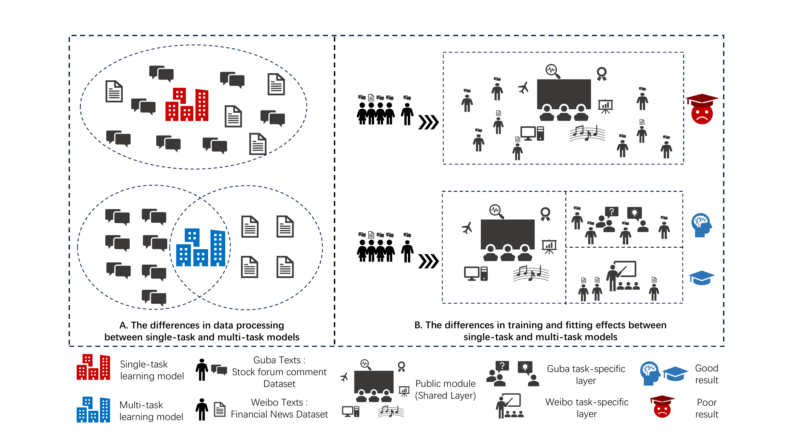
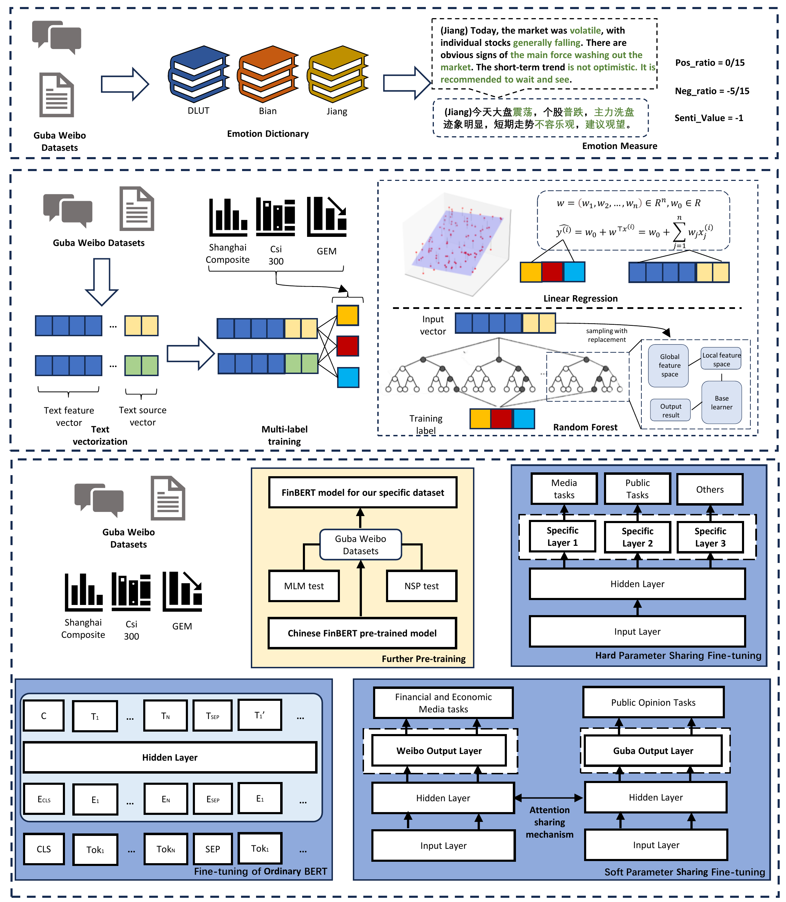

# MTL-FinBERT  
---


## 📌 Project Overview

This project provides the source code for the paper *“MTL-FinBERT: A Multi-Task Learning Framework for Heterogeneous Financial Text Sentiment Analysis in Digital Finance Ecosystems.”*  
It aims to improve the accuracy and scalability of cross-modal and heterogeneous text sentiment analysis in financial markets through a FinBERT architecture enhanced by multi-task learning.


---
## ✨ Technical Introduction

The deep learning sentiment measurement component of this project is based on a PyTorch framework and FinBERT pre-training, with further structural enhancements.  
The architecture consists of a shared feature extraction layer (to capture common patterns across heterogeneous texts) and task-specific layers (to preserve data-source-specific features),  
together with a cross-text shared mechanism to enable multi-objective collaborative optimization.  

To benchmark the proposed model, the paper compares eight sentiment measurement methods across three model categories:  
- Dictionary-based: DLUT, Bian, Jiang  
- Machine Learning: LR, RF + (TF-IDF + text-source vector)  
- Deep Learning: FinBERT, MTL-FinBERT (Ours)  

  
  

---
## 🚀 Quick Start

### Environment
```bash
pip install -r requirements.txt
```

### Run
A: Sentiment Measurement
```
# Dictionary-based
python A_Emo_Measure/Emo-Dict/EmoMeasure.py # automatically runs all three dictionaries

# Machine Learning
python A_Emo_Measure/Machine-learning/LR/train.py # train linear regression
python A_Emo_Measure/Machine-learning/LR/predict.py # predict sentiment with linear regression

python A_Emo_Measure/Machine-learning/RF/train.py # train random forest
python A_Emo_Measure/Machine-learning/RF/predict.py # predict sentiment with random forest

# Deep Learning
python A_Emo_Measure/Deep-learning/A_Pre_Train/Simple-Task-Model/A_Pre_Train/PreTrain.py # further pre-training of FinBERT
python A_Emo_Measure/Deep-learning/A_Pre_Train/Multi-Task-Model/A_Pre_Train/PreTrain.py # further pre-training of FinBERT (alternative, choose one)

python A_Emo_Measure/Deep-learning/A_Pre_Train/Simple-Task-Model/B_Fine_Tuning/train.py # FinBERT # supervised fine-tuning of FinBERT
python A_Emo_Measure/Deep-learning/A_Pre_Train/Simple-Task-Model/B_Fine_Tuning/eval.py # FinBERT # sentiment measurement with FinBERT

python A_Emo_Measure/Deep-learning/A_Pre_Train/Multi-Task-Model/B_Fine_Tuning/train.py # MTL-FinBERT # supervised fine-tuning of MTL-FinBERT
python A_Emo_Measure/Deep-learning/A_Pre_Train/Multi-Task-Model/B_Fine_Tuning/eval.py # MTL-FinBERT # sentiment measurement with MTL-FinBERT
```
B: Sentiment Measurement Evaluation
```
python B_Result_Analysis/evaluate_models_every_day.py # error evaluation by daily aggregated sentiment
python B_Result_Analysis/evaluate_models_every_texts.py # error evaluation by individual text sentiment
```
C: Empirical Analysis and D: Investment Portfolio are mainly ipynb files, run them under Jupyter  

---
## 📂 项目结构

```
Multi-Task-Learning/
├── A_Emo_Measure/                 # Sentiment measurement module
│   ├── bert-base-chinese/         # Chinese BERT pretrained model
│   ├── data/                      # Sentiment model training and prediction data (using pessimistic estimation) (Input)
│   ├── Deep-learning/             # Deep learning module
│   │    ├── Multi-Task-Model/     # Multi-task learning model <----Ours
│   │    │    ├── A_Pre_Train/     # Pre-training module
│   │    │    ├── B_Fine_Tuning/   # Fine-tuning module
│   │    │    ├── loss/            # Loss records (Output)
│   │    │    ├── model/           # Model weights (Output)
│   │    │    └── results/         # Results (Output)
│   │    └── Simple-Task-Model/    # Single-task learning model
│   ├── Emo-Dict/                  # Sentiment dictionary module
│   │    ├── Bian/                 # Chinese financial sentiment dictionary by Shanghai University of Finance and Economics (Bian et al., 2019)
│   │    ├── DLUT/                 # Dalian University of Technology sentiment dictionary
│   │    ├── Jiang/                # Financial sentiment dictionary by Central University of Finance and Economics (Jiang et al., 2021)
│   │    ├── EmoMeasure.py         # Main script for dictionary-based sentiment measurement
│   │    ├── utils.py              # Utility scripts
│   └── Machine-learning/          # Machine learning module
│        ├── LR/                   # Logistic regression
│        └── RF/                   # Random forest
│
├── B_Result_Analysis/                 # Results analysis module
│   ├── evaluate_models_every_day.py   # Error evaluation based on daily aggregated sentiment
│   ├── evaluate_models_every_texts.py # Error evaluation based on each text
│   ├── evaluation/                    # Evaluation indicators (Output)
│   └── Measurement_Result/            # Sentiment measurement results from three model categories (Input)
│
├── C_Empirical_Analysis/              # Empirical analysis module
│   ├── data/                          # Data needed for empirical analysis (Input)
│   │    ├── Emo_data                  # Sentiment text data
│   │    ├── Financial_data            # Financial and economic data
│   ├── Data_Mine/                     # Data mining — extracting structural information from sentiment results
│   └── Statistical_test/              # Statistical tests on four types of macroeconomic variables
│
└── D_Investment_Portfolio/            # Investment portfolio module
    ├── data/                          # Investment data (Input)
    ├── Emotion_Extraction/            # Stock-level sentiment measurement based on transfer learning
    └── Investment_portfolio/          # Empirical analysis and investment portfolio strategy

```
---

## 📊 Data Description

The sentiment text data in this project is divided into two categories. The first is a macro-market dataset, which includes overall stock forum sentiment texts and Weibo sentiment texts.  
The second is a stock-level dataset, containing sentiment texts corresponding to individual stocks. Examples are shown below:


### Macro Market Dataset:
{
    "date": "2015-03-16",                // Date (string)
    "index": [2.2649, 2.4329, 3.5572],  // Indicator vector (example: 3-dimensional float vector)
    "guba_data": ["text1", "text2", ...],  // List of stock forum sentiment texts
    "weibo_data": ["text1", "text2", ...]  // List of Weibo sentiment texts
}

- `date`: Timestamp, accurate to the day  
- `index`: Regression labels (market index returns)  
- `guba_data`: Collection of user texts from stock forums  
- `weibo_data`: Collection of user texts from Weibo  

Each JSON list element can be seen as a daily data snapshot, containing the sentiment labels for that day and multiple social media texts.  
Subsequent models will perform multi-task multi-label sentiment regression based on this data.

### Securities Related Dataset:  
Sentiment data at the security level is stored in CSV format, with main fields as follows:

| Field      | Description                            | Example                   |
|------------|-------------------------------------|---------------------------|
| Read Count | Number of times the text was read    | 568                       |
| Comment Count | Number of comments under the text  | 1                         |
| Text       | Text posted by the user              | A brief discussion on value investing and speculation |
| Author     | Username                            | Anonymous                  |
| Month      | Month of posting (for seasonal analysis) | 12                        |
| Date       | Posting date (accurate to the day)  | 2024-12-29                |

Sample data:  
Read Count, Comment Count, Text, Author, Month, Date  
568, 1, A brief discussion on value investing and speculation, Anonymous, 12, 2024-12-29  
1432, 7, Sunac's domestic bond restructuring round two, negotiation difficulty increases, Anonymous, 11, 2024-11-17  
1749, 11, Can market value management benefits improve Vanke’s stock price movement, Anonymous, 11, 2024-11-16  
274, 0, Real estate companies continue to exchange price for volume; in October this year, Vanke achieved contract sales area of 1.439 million square meters, contract sales amount, Anonymous, 11, 2024-11-13  

This dataset can be used for extracting sentiment information at the individual stock or industry level, combined with stock codes and trading data, enabling fine-grained portfolio research or multi-task prediction.

