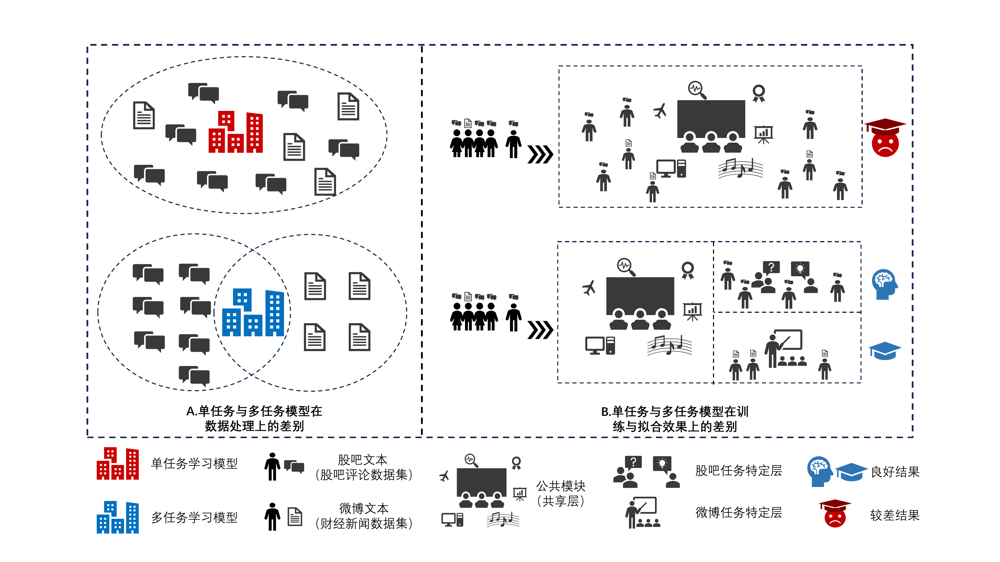
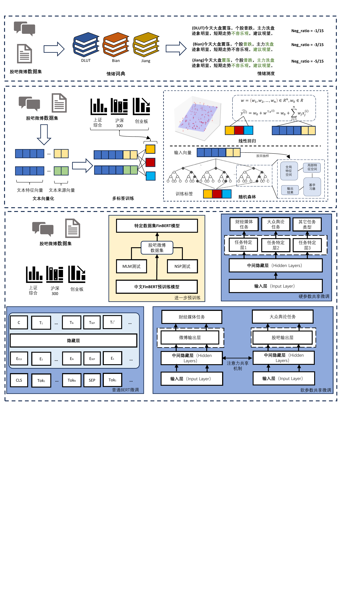

# MTL-FinBERT  
---


## 📌 项目简介

本项目是论文《MTL-FinBERT：数字金融生态系统中异构金融文本情感分析的多任务学习框架》的配套代码。  
旨在通过作者提出的多任务学习 的 FinBERT 架构，提升金融市场中跨模态、异质化文本情感分析的准确性和可扩展性。


---
## ✨ 技术介绍
本项目深度学习情绪测度部分基于pytorch架构以及FinBERT预训练，进行网络结构升级，
架构通过底层特征提取层（捕捉异质文本共性特征）与任务特定层（保留数据源特异性），
再融合跨文本共享机制去增加关联进行多目标协同优化。  

同时为对比本模型的效果，本文共提出三类模型共八种情绪测度方法进行对比，分别是：  
- 字典法：DLUT、Bian、Jiang  
- 机器学习：LR、RF + (TF-IDF + 文本来源向量)  
- 深度学习：FinBERT、 MTL-FinBERT(Ours)  



---
## 🚀 快速开始

### 配置环境
```bash
pip install -r requirements.txt
```

### 运行
A: 情绪测度
```
# 词典法
python A_Emo_Measure/Emo-Dict/EmoMeasure.py # 自动遍历运行三个字典

# 机器学习法
python A_Emo_Measure/Machine-learning/LR/train.py # 线性回归训练
python A_Emo_Measure/Machine-learning/LR/predict.py # 线性回归情绪测度

python A_Emo_Measure/Machine-learning/RF/train.py # 随机森林训练
python A_Emo_Measure/Machine-learning/RF/predict.py # 随机森林情绪测度

# 深度学习法
python A_Emo_Measure/Deep-learning/A_Pre_Train/Simple-Task-Model/A_Pre_Train/PreTrain.py # FinBERT 进一步预训练
python A_Emo_Measure/Deep-learning/A_Pre_Train/Multi-Task-Model/A_Pre_Train/PreTrain.py # FinBERT 进一步预训练(与上同，任选一即可)

python A_Emo_Measure/Deep-learning/A_Pre_Train/Simple-Task-Model/B_Fine_Tuning/train.py # FinBERT 监督微调
python A_Emo_Measure/Deep-learning/A_Pre_Train/Simple-Task-Model/B_Fine_Tuning/eval.py # FinBERT 情绪测度

python A_Emo_Measure/Deep-learning/A_Pre_Train/Multi-Task-Model/B_Fine_Tuning/train.py # MTL-FinBERT 监督微调
python A_Emo_Measure/Deep-learning/A_Pre_Train/Multi-Task-Model/B_Fine_Tuning/eval.py # MTL-FinBERT 情绪测度
```
B: 测度结果检验
```
python B_Result_Analysis/evaluate_models_every_day.py # 按每天综合情绪进行误差检验
python B_Result_Analysis/evaluate_models_every_texts.py # 按每条文本情绪进行误差检验
```
C: 实证分析 与 D: 投资组合 多为ipynb文件，在jupyter下运行  

---
## 📂 项目结构

```
Multi-Task-Learning/
├── A_Emo_Measure/                 # 情绪测度模块
│   ├── bert-base-chinese/         # BERT中文预训练模型
│   ├── data/                      # 情绪模型训练数据与预测数据（后续均采用悲观估计结果）(Input)
│   ├── Deep-learning/                  # 深度学习模块
│   │    ├── Multi-Task-Model/          # 多任务学习模型 <----Ours
│   │    │    ├── A_Pre_Train/            # 预训练模块
│   │    │    ├── B_Fine_Tuning/          # 微调模块
│   │    │    ├── loss/                   # 损失记录(Output)
│   │    │    ├── model/                  # 权重保存(Output)
│   │    │    └── results/                # 结果输出(Output)
│   │    └── Simple-Task-Model/         # 单任务学习模型
│   ├── Emo-Dict/                       # 情绪词典模块
│   │    ├── Bian/                      # 上海财经大学卞世博等开发的中文财经领域情绪词典(卞等，2019)
│   │    ├── DLUT/                      # 大连理工大学情感词典(DLUT)
│   │    ├── Jiang/                     # 中央财经大学姜富伟等开发的中文金融文本情绪词典(姜富伟等，2021)
│   │    ├── EmoMeasure.py              # 词典法情绪测度主程序
│   │    ├── utils.py                   # 工具脚本
│   └── Machine-learning/               # 机器学习模块
│        ├── LR/                        # 逻辑回归
│        └── RF/                        # 随机森林
│
├── B_Result_Analysis/                 # 结果分析模块
│   ├── evaluate_models_every_day.py   # 按每天综合情绪进行误差检验
│   ├── evaluate_models_every_texts.py # 按每条文本情绪进行误差检验
│   ├── evaluation/                    # 评估指标存放(Output)
│   └── Measurement_Result/            # 三类模型的情绪测度结果(Input)
│
├── C_Empirical_Analysis/          # 实证分析模块
│   ├── data/                      # 实证所需数据(Input)
│   │    ├── Emo_data              # 文本情绪数据
│   │    ├── Financial_data        # 金融经济数据
│   ├── Data_Mine/                 # 数据挖掘——提取情绪结果的结构信息
│   └── Statistical_test/          # 统计检验——四类宏观经济变量统计检验
│
└── D_Investment_Portfolio/        # 投资组合模块
    ├── data/                      # 投资所需数据(Input)
    ├── Emotion_Extraction/        # 个股情绪测度——深度迁移学习
    └── Investment_portfolio/      # 个股实证分析与与投资组合策略
```
---

## 📊 数据介绍

本项目中的情绪文本数据共分两类，一类是大盘宏观数据集，包含市场整体的股吧情绪文本与微博情绪文本；  
另一类是证券关联数据集，为个股对应的情绪文本数据。示例如下：

### 大盘宏观数据集:
{
    "date": "2015-03-16",                # 日期 (字符串)
    "index": [2.2649, 2.4329, 3.5572],    # 指标向量 (示例为三维浮点数向量)
    "guba_data": ["text1", "text2", ...],   # 股吧情绪文本列表
    "weibo_data": ["text1", "text2", ...]   # 微博情绪文本列表
}

- `date` ：时间戳，精确到日  
- `index` ：回归标签（大盘指数收益率）
- `guba_data` ：来源于股吧的用户文本集合  
- `weibo_data` ：来源于微博的用户文本集合

其中，每一条 JSON 列表元素可以看作一天的数据快照，包含该日的情绪标签及对应的多条社交媒体文本。  
后续模型将基于这些数据进行多任务多标签的情绪回归。

### 证券关联数据集:  
证券级别的情绪数据以 CSV 格式存储，主要字段示例如下：

| 字段       | 说明                                  | 示例                      |
|------------|---------------------------------------|---------------------------|
| 阅读数     | 该条文本被阅读的次数                  | 568                       |
| 评论数     | 该条文本下的评论数                    | 1                         |
| 文本       | 用户发布的情绪文本                    | 浅谈价值投资与投机        |
| 发布者     | 用户名                                | 跌入我心                  |
| 月份       | 发布时间的月份（便于季节性分析）       | 12                        |
| 日期       | 发布时间（精确到日）                   | 2024-12-29                |

示例数据：
阅读数,评论数,文本,发布者,月份,日期
568, 1, 浅谈价值投资与投机, Anonymous, 12, 2024-12-29  
1432, 7, 融创境内债二次重组，此轮协商难度更大, Anonymous, 11, 2024-11-17  
1749, 11, 市值管理利好能不能给万科股价运行带来改善, Anonymous, 11, 2024-11-16  
274,0, 房企继续以价换量今年10月，万科实现合同销售面积143.9万平方米，合同销售金额, Anonymous, 11, 2024-11-13  

该数据集可用于对个股或行业层面的情绪信息提取，结合股票代码及交易数据，实现细粒度的投资组合研究或多任务预测。 
